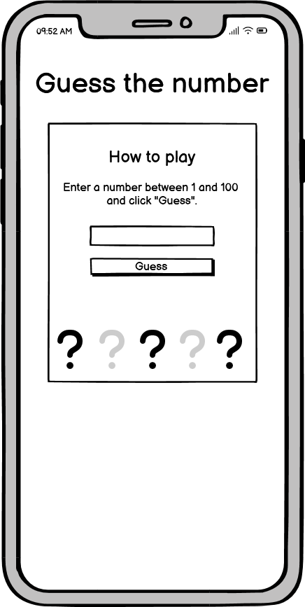
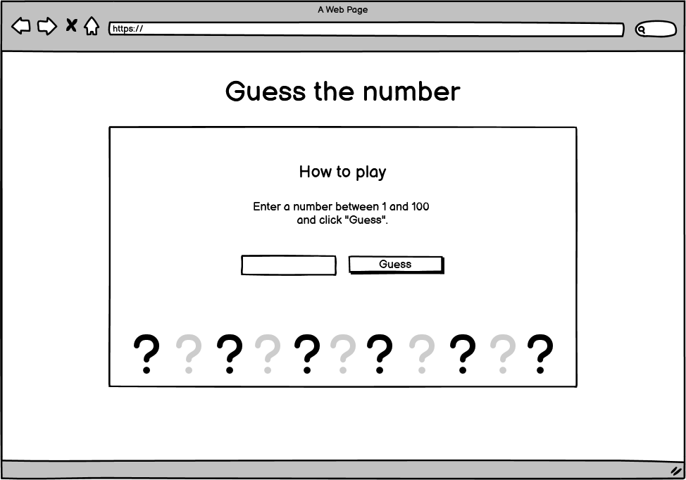

# **Guess the number**

## **Planning**
For our second group project we decided to do a simple JavaScript "Guess the number" game.
We decided to start the game with a version as easy as possible and had possible upgrades in our mind if there is still time near the project deadline.

The basic steps for our project will be:

1. user inputs a number between 1-100 in a field (using html to ensure only a number with a min value of 1 and a max value of 100 can be submitted)
2. the number from the user is compared against randomly generated number (this happens in the background, the user doesn't see the randomly generated number)
3. if the user inputs a number which is:
    - equal to the generated number: "Congratulations! [...]"
    - too high: "That was too high. Guess again!"
    - too low: "That was too low. Guess again!"
4. After the user guesses correctly (unlimited tries), the game is reset.

### **Wireframes**

## **Functions**

## **Testing**