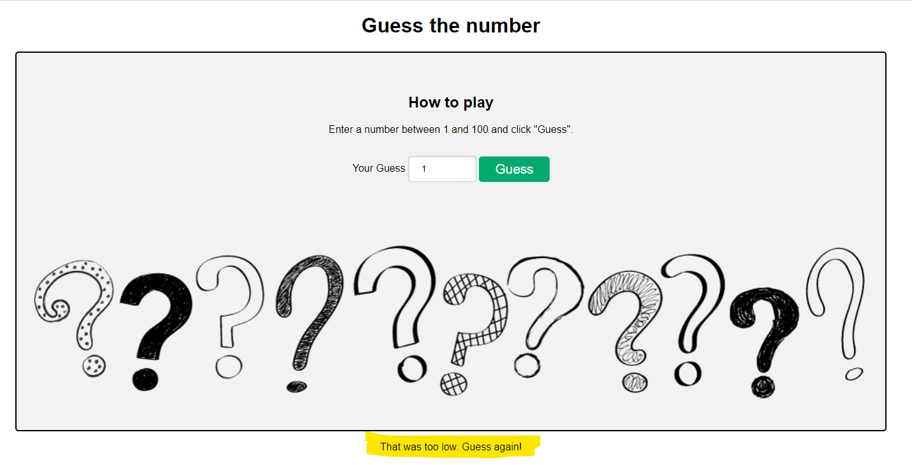
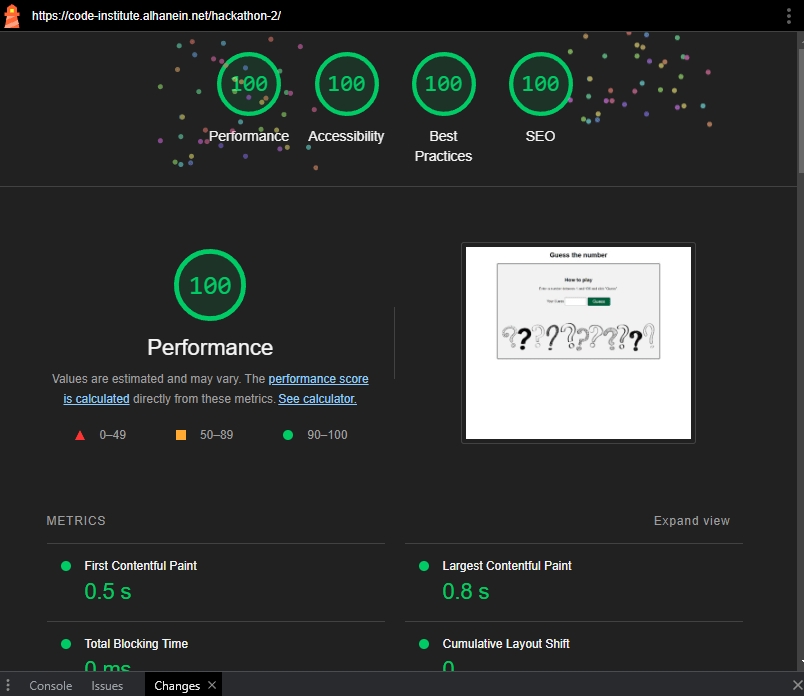

# **Guess the number**

## **Planning**
For our second group project we decided to do a simple JavaScript "Guess the number" game.
We decided to start the game with a version as easy as possible and had possible upgrades in our mind if there is still time near the project deadline.

The basic steps for our project will be:

1. user inputs a number between 1-100 in a field (using html to ensure only a number with a min value of 1 and a max value of 100 can be submitted)
2. the user's number is compared against a randomly generated number (this happens in the background, the user doesn't see the randomly generated number)
3. if the user inputs a number which is:
    - equal to the generated number: "Congratulations! [...]"
    - too high: "That was too high. Guess again!"
    - too low: "That was too low. Guess again!"
4. After the user guesses correctly (unlimited tries), the game is reset.

### **Wireframes**

## **Functions and Features**
The game has a basic layout with some JS functions running in the background.

### **Home Page**

The home page shows the title of the game on top.
Below the title, there are very short and concise instructions on how the game is played.
The main image shows fun question marks indicating the playful nature of the site.

### **Input Field**

Below the instructions on how to play the game there is an input field. This field receives the input from the user and is set to only accept integers between 1-100. Once the user is happy with their input, they click the "Guess" button.

### **Randomly Generated Number: randomNumber**
The moment the page is loaded, a random number between 1-100 is generated in the background using JS.

### **Comparison of randomNumber with userNumber**
Once the user inputs a number into the input field and clicks the "Guess" button, JS takes the userNumber and compares it to the randomNumber.

### **Outcome Options**
1. 
    If the userNumber matches the randomNumber exactly (i.e. the user guessed the correct number), an alert displays a success message. The user is also asked whether they would like to play again.
2. 
    If the userNumber is lower than the randomNumber (i.e. the user guessed too low), a message below the main image tells the user that their guess was too low, and encourages the user to try again.
3. 
    If the userNumber is higher than the randomNumber (i.e. the user guessed too high), a message below the main image tells the user that their guess was too high, and encourages the user to try again.

### **End of Game**
Once the user has guessed correctly they can choose to play again. Alternatively, the user may reload the page.
Either option resets the game and the user can start from the beginning.

## **Testing**

### Manual Testing 
* The game was tested playing in different browsers: Chrome and Firefox on desktop and mobile.
* The project is responsive, looks good and functions on all standard screen sizes.

### Lighthouse report

* for mobile

* for desktop

### Validator Testing
* HTML 
  * No errors were returned when passing through the official W3C validator

* CSS
  * No errors were found when passing through the official (jigsaw) validator

## Deployment
The site was deployed to Github pages. The steps are as follows:
In the GitHub repository, navigate to the Settings tab
From the source destination drop-down menu, select the Master Branch
Once the master branch has been selected, the page provided the link to the complete website.

The live link can be found here: [Guess the Number](https://mariahochstoeger.github.io/GroupProject2/)

